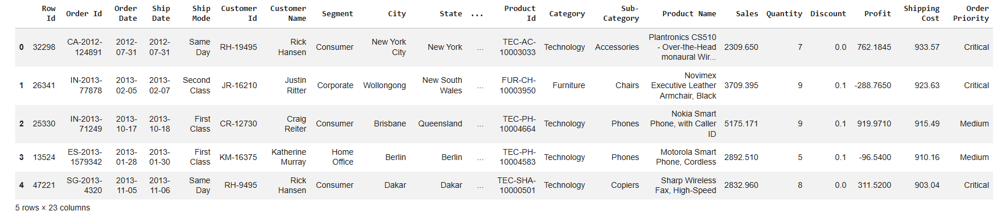

# Data Cleaning and Preparation using Python

## Project Overview
This project focuses on cleaning and preparing the Global Superstore dataset using Python and Pandas. The goal is to transform raw data into a clean and structured format suitable for analysis and visualization.

## Dataset
Global Superstore Dataset

## Tools & Technologies
- Python  
- Pandas  
- Google Colab  

## Tasks Performed
- Handled missing values  
- Removed duplicate records  
- Converted data types (Date format)  
- Performed data cleaning and preprocessing  
- Exported cleaned dataset  

## Output
A clean and structured dataset ready for further analysis and visualization.

## Key Learnings
- Importance of data cleaning in analytics  
- Handling real-world messy datasets  
- Data preprocessing techniques using Pandas  

## Project Screenshot
  
- Performed data cleaning and preprocessing  
- Exported cleaned dataset  

## 📊 Output
A clean and structured dataset ready for further analysis and visualization.

## 🚀 Key Learnings
- Importance of data cleaning in analytics  
- Handling real-world messy datasets  
- Data preprocessing techniques using Pandas  

## 📸 Project Screenshot

